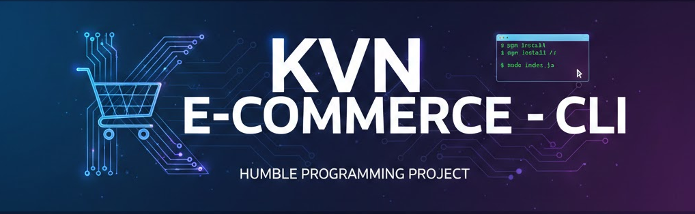

<p align="center">
  
</p>

## 📌 Índice

- [📋 Sobre o Projeto](#sobre-o-projeto)
- [🚀 Tecnologias Utilizadas](#tecnologias-utilizadas)
- [📁 Estrutura do Projeto](#estrutura-do-projeto)
- [⚙️ Arquitetura do Sistema](#arquitetura-do-sistema)
- [🔧 Instalação e Configuração](#instalação-e-configuração)
- [📖 Como Usar](#como-usar)
- [🧪 Regras de Validação](#regras-de-validação-exemplos)

### 🛒 KVN E-COMMERCE - Sistema de Gestão de Produtos

<div align="justify">
Sistema de gerenciamento de estoque para e-commerce desenvolvido em TypeScript, utilizando os pilares da Programação Orientada a Objetos (POO) para gerenciar diferentes tipos de eletrônicos.
</div>


## <a id="sobre-o-projeto"></a> 📋 Sobre o Projeto
<div align="justify">
O KVN E-COMMERCE é uma aplicação CLI (Command Line Interface) robusta que permite o controle total sobre o catálogo de produtos. O sistema utiliza conceitos avançados como Herança, Polimorfismo e Encapsulamento para diferenciar produtos genéricos de itens específicos como Celulares e Notebooks.
</div>
<br>

**Funcionalidades principais:**

- ✅ **Cadastro de Produtos:** Adição de Notebooks e Celulares com atributos específicos.

- ✅ **Listagem Geral:** Visualização detalhada de todos os itens no estoque.

- ✅ **Busca por ID:** Localização rápida de um produto específico.

- ✅ **Atualização:** Edição de informações de produtos existentes.

- ✅ **Exclusão:** Remoção de itens do sistema com validação de existência.

- ✅ **Validação de Dados:** Setters inteligentes que impedem dados inválidos (ex: RAM negativa ou SO inexistente).


## <a id="tecnologias-utilizadas"></a> 🚀 Tecnologias Utilizadas

- **TypeScript** - Linguagem principal para tipagem estática e POO.

- **Node.js** - Ambiente de execução.

- **Readline-sync** - Biblioteca para interação síncrona com o usuário via terminal.


## <a id="estrutura-do-projeto"></a> 📁 Estrutura do Projeto
```
KVN E-COMMERCE/
├── Menu.ts                        # Ponto de entrada da aplicação, contém o menu interativo e a lógica de CLI
├── README.md                      # Documentação técnica do projeto, guias de instalação e uso
├── src/
│   ├── contrller/
│   │   └── ProdutoController.ts   # Implementação do CRUD, gerencia o armazenamento e busca de produtos no array
│   ├── model/
│   │   ├── Celular.ts             # Subclasse de Produto com atributos específicos (SO, armazenamento, câmera)
│   │   ├── Notebook.ts            # Subclasse de Produto com atributos específicos (processador, RAM, tela)
│   │   └── Produto.ts             # Classe abstrata base que define atributos comuns como ID, nome e preço
│   └── repository/
│       └── IProdutoRepository.ts  # Interface que define o contrato e os métodos obrigatórios para o repositório
└── tsconfig.json                  # Arquivo de configuração do compilador TypeScript
```


## <a id="arquitetura-do-sistema"></a> ⚙️ Arquitetura do Sistema
### 1. Modelos de Dados
O sistema utiliza uma classe abstrata Produto para garantir que nenhum produto "genérico" seja criado sem especialização:

- **Notebook:** Inclui atributos como Processador, Memória RAM e Tamanho da Tela.

- **Celular:** Inclui atributos como Sistema Operacional, Armazenamento e Resolução da Câmera.

### 2. Controlador (Controller)
A classe ProdutoController centraliza a lógica de armazenamento em um array privado, garantindo que o acesso aos dados siga as regras definidas na interface ProdutoRepository.


## <a id="instalação-e-configuração"></a> 🔧 Instalação e Configuração
#### Pré-requisitos
- Node.js instalado.

- Gerenciador de pacotes (npm ou yarn).

Passo a Passo
#### 1. Instale as dependências
```bash
npm install readline-sync
npm install --save-dev @types/readline-sync
```
#### 2. Compile o código (caso use tsc)
```bash
tsc
```

#### 3. Execute o sistema
```bash
node Menu.js
```

## <a id="como-usar"></a> 📖 Como Usar
Ao iniciar o sistema, você verá um menu interativo:

**1. Adicionar Novo Produto:** Escolha entre Notebook ou Celular. O sistema solicitará os dados técnicos e validará, por exemplo, se a RAM é múltipla de 4.

**2. Editar Produto:** Informe o ID. O sistema permite alterar nome e preço, mantendo as especificações técnicas originais.

**3. Deletar Produto:** Remove o item do array permanentemente através do ID.

**4. Listar Todos:** Exibe um relatório completo de todos os produtos com suas especificações formatadas.

**5. Listar por ID:** Exibe os detalhes de apenas um item específico.


## <a id="regras-de-validação-exemplos"></a> 🧪 Regras de Validação (Exemplos)
O sistema possui inteligência nos modelos para evitar erros de inventário:

**Memória RAM:** Deve ser positiva e múltipla de 4 (ex: 8, 16, 32 GB).

**Armazenamento:** Aceita apenas valores padrão de mercado (64, 128, 256, 512, 1024 GB).

**Sistema Operacional:** Restrito a 'Android' ou 'iOS'.

**Preço:** Bloqueia a inserção de valores negativos ou zero.
<hr>

***KVN E-COMMERCE - Organizando seu estoque com tecnologia e precisão.***